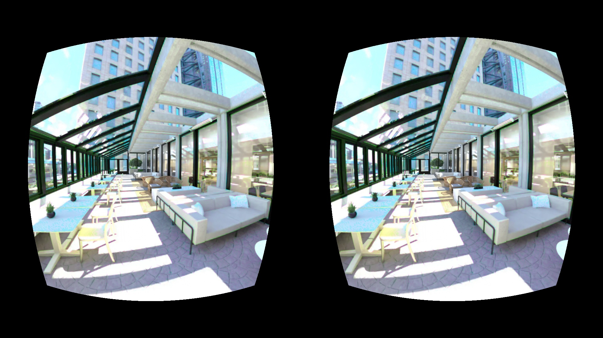

# Demo of VR Image Color Optimization Pipeline

## 1. Overview

&nbsp; &nbsp; This project demonstrates color optimizer in the ASPLOS-2024 Paper [Exploiting Human Color Discrimination for Memory and Energy-Efficient Image Encoding in Virtual Reality](https://horizon-lab.org/pubs/asplos24-vr.pdf) on a FPGA board. This optimizer uses the limits of human color perception to reduce image color size. By subtly adjusting pixel colors within a humanly imperceptible range which depends on eccentricity, it brings colors of pixels closer, enhancing the efficiency of the following Base Delta compression algorithm. Finally, this foveated compression can make the system more memory and energy-efficient

### 1.1 Overall Pipeline

&nbsp; &nbsp; The figure illustrates the project's comprehensive pipeline, transforming panoramic video into the foveated compressed (Color Optimiz) video compatible with Google Cardboard. The pipeline is divided into two main module groups: one operating on the host machine and the other on an FPGA. The host machine handles video decoding, projection, parameter precomputation, and rearrangement. In contrast, the FPGA accelerates color adjustment and lens correction. These two platforms are interconnected via an HDMI cable. The final output is rendered on the VR display for immersive viewing.


### 1.2 Examples of the foveated compressed output


## 2. Files Organization

- `host/`: Codes for the Host Machine.
    - `video_decode/`: codes for video decode.
    - `projection/`: codes for eqirectangular to binocular images projection.
    - `fpga_input_generation/`: codes for abc, dkl computaton and reaarangement.
    - `pygame/`: codes for sending image contains parameters through HDMI.
    - `len_correction/`: codes for len correction (implemented in software)
    - `color_optimizer`:  codes for color optimizer (implemented in software)
    - `full_pipeline_in_software/`: codes to run the full pipeline in software. Convenient for expected results observation and parameter configuration.


- `fpga/`:  Codes for FPGA.
    - `tile_color_optimizer_hls/`: HLS implementation of color optimizer.
    - `len_correction_hls/`: HLS implementation of len correction.
    - `rearrangment/`: Verilog and HLS implementation of reaarange ment IP (RIP) on FPGA.
    - `vivado/`: codes for generate and connect all other modules in a block design.
    - `pynq_scripts/`: Jupyter note code for control modules in run time using ARM on the fpga board. 

## 3. Usage of Software-Only Pipeline

&nbsp; &nbsp;  This section is about how to run the full pipeline in software only manner. It is useful quick check of  expected result. It mainly contains below pipeline


### 3.1 Video Preparation: 
To start this experiment, you need to prepare a panoramic Video in equirectangular format.

If you don't have one, you can download our demo video from https://drive.google.com/file/d/1feO5JxJLpI8r2QzsmC18rC69gUGPxRmw/view?usp=sharing

```bash
mkdir videos # make videos directory in the main folder
# this link is for wget, above one is for browser
wget 'https://drive.google.com/uc?id=1feO5JxJLpI8r2QzsmC18rC69gUGPxRmw' -O videos/demo_video.mp4
```

### 3.2 Decode Video to a Folder of Images

In this step, we need to decode the videos to images to facilitate later multiprocessing.
```bash
cd host/video_decode
python3 decode_video.py --video_path ../../videos/demo_video.mp4 --out_images_folder ../../decoded_images
```
Now you can find decoded images in the main folder. To reduce downstream computatation, you can choose to preserve only 60 of them
```bash
bash filter_decoded_images.bash "../../decoded_images" 60
```

### 3.3 Run the Full color optimizer pipeline


(1) The pipeline for one frame is implemented in ```host/full_pipeline_in_software/software_pipeline_per_frame.py```, please refer it to see how to use and concatenate all modules.

(2) Every module's main function also shows example of how to use it. You just need to go to the corresponding folder and run the python code. For example, the example code for projection is drawing the cube map, you can run it as follow:
```bash
cd cc_vr_pipeline/host/projection
python3 equirect_to_pespective.py
```

(3) We provide two scripts to run the Full color optimizer pipeline, the first one is a simple loop that process frame by frame. The other one is a multiprocessor implementation. For this project, the left and right eye images are exactly the same, since the input is a single equirectangular image, which supports only 3 DoF.  If the input video is captured in, for instance, an Omni-Directional Stereo (ODS) format, we could render actual stereo disparity.  See [this slide deck](https://cs.rochester.edu/courses/572/fall2022/decks/lect17-immersive.pdf) for details.  Because of this limitation, observers don't get depth perception from stereo disparity.

See ```cc_vr_pipeline/host/pipeline_args.py``` for support args.

- For the simple loop one: (this one will give you Progress Bar)
```bash 
cd cc_vr_pipeline/host/full_pipeline_in_software
python3 software_pipeline_per_frame_loop.py --in_images_folder ../../decoded_images --out_images_folder ../../corrected_opt_images

```

- For multiprocessor implementation (this one won't give Progress Bar, you need to count file num in output folder to get progress. Run ```ls -l | wc -l``` in that folder. The output number substracted by one is the file number.)
```bash
cd cc_vr_pipeline/host/full_pipeline_in_software
python3 software_pipeline_multicores.py --in_images_folder ../../decoded_images --out_images_folder ../../corrected_opt_images --num_workers 8
```

(4) After running the above codes, you will see output in ```corrected_opt_images/``` folder in main directory.

(5) Video Encoding (Encode images back to video , TO BE ADD)

## 4. Usage of SW-HW Pipeline

TO BE DONE
