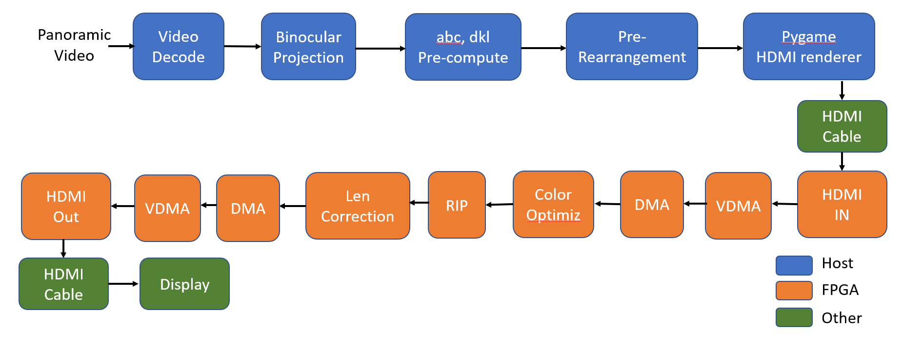
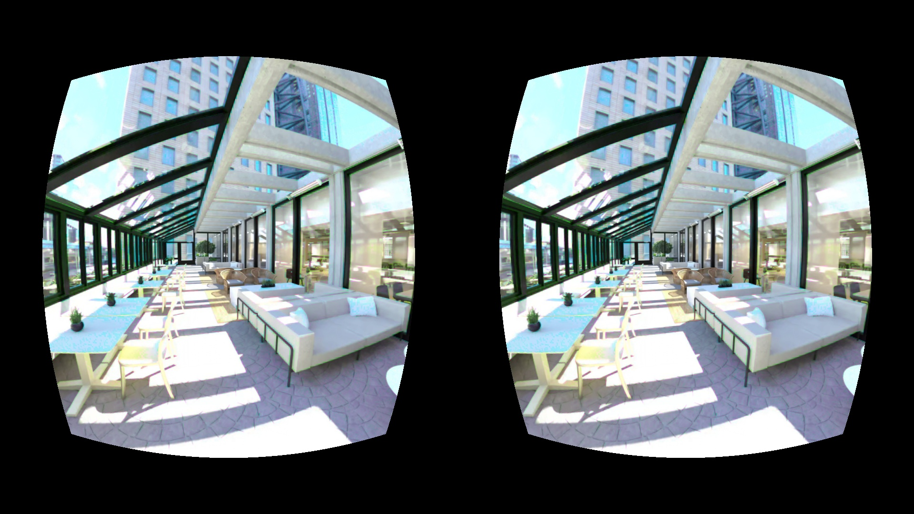

# Demo of VR Image Color Optimization Pipeline

## 1. Overview

&nbsp; &nbsp; This project demonstrates color optimizer in the ASPLOS-2024 Paper [Exploiting Human Color Discrimination for Memory and Energy-Efficient Image Encoding in Virtual Reality](https://horizon-lab.org/pubs/asplos24-vr.pdf) on a FPGA board. This optimizer uses the limits of human color perception to reduce image color size. By subtly adjusting pixel colors within a humanly imperceptible range which depends on eccentricity, it brings colors of pixels closer, enhancing the efficiency of the following Base Delta compression algorithm. Finally, this foveated compression can make the system more memory and energy-efficient

### 1.1 Overall Pipeline

&nbsp; &nbsp; The figure illustrates the project's comprehensive pipeline, transforming panoramic video into the foveated compressed (Color Optimiz) video compatible with Google Cardboard. The pipeline is divided into two main module groups: one operating on the host machine and the other on an FPGA. The host machine handles video decoding, projection, parameter precomputation, and rearrangement. In contrast, the FPGA accelerates color adjustment and lens correction. These two platforms are interconnected via an HDMI cable. The final output is rendered on the VR display for immersive viewing.



### 1.2 Examples of the foveated compressed output


## 2. Files Organization

- `host/`: Codes for the Host Machine.
    - `video_decode/`: codes for video decode.
    - `binocular_projection/`: codes for eqirectangular to binocular images projection.
    - `fpga_input_generation/`: codes for abc, dkl computaton and reaarangement.
    - `pygame/`: codes for sending image contains parameters through HDMI.
    - `len_correction/`: codes for len correction (implemented in software)
    - `full_pipeline_in_software/`: codes to run the full pipeline in software. Convenient for expected results observation and parameter configuration.


- `fpga/`:  Codes for FPGA.
    - `tile_color_optimizer_hls/`: HLS implementation of color optimizer.
    - `len_correction_hls/`: HLS implementation of color optimizer.
    - `rearrangment/`: Verilog and HLS implementation of reaarange ment IP (RIP) on FPGA.
    - `vivado/`: codes for generate and connect all other modules in a block design.
    - `pynq_scripts/`: Jupyter note code for control modules in run time using ARM on the fpga board. 

## 3. Usage

### 3.1 Preparation: 
- Host machine:
    - Python with libs needed in `ref_python/`, `pygame/`
    - install Vitis  2022.2
    - install Vivado 2022.2

- ZCU104 Board:
    - Install pynq image

### 3.2 Prepare test data

- For HLS verification: 

    ```bash
    cd ref_python
    python3 red_blue_optimization.py --img <path_to_img> --dump True --dump_path ./gold_sequence
    ```

- For board input

    ```bash
    cd ref_python

    # Run this line to decode video to images if you use video
    python3 decode_video.py --video_path <path_to_video> --images_folder <path_to_store_images> 

    python3 generate_board_inputs.py --images_folder <path_to_images> --board_inputs_folder <path_to_store_board_inputs> --num_workers <num_of_workers>
    ```

### 3.3 Generate / Verify HLS Hardware Accelerator

- Synthesize the C++ to RTL and generate the IP

    ```bash
    cd tile_color_optimizer_hls
    source <path_to_vitis_2022.2>/settings64.sh # e.g. source /tools/Xilinx/Vitis_HLS/2022.1/settings64.sh
    bash generate_ip.sh <path_to_store_ip>
    ```
    
- Test the generated RTL codes (Not necessary)

    ```bash
    cd tile_color_optimizer_hls
    bash cosim.sh
    ```

### 3.4 Build the vivado block design and generate bitstream / .hwh for pynq

- Build the base design from official repo:

    ```bash
    cd vivado 
    git clone https://github.com/Xilinx/PYNQ.git
    cd PYNQ/boards/ZCU104/base/

    # activate vivado environment
    source <path_to_vivado_2022.2>/settings64.sh # e.g. source /tools/Xilinx/Vivado/2022.1/settings64.sh
    # start building
    vivado -mode batch -source ./build_ip.tcl & 
    vivado -mode batch -source ./base.tcl &
    vivado -mode batch -source build_bitstream.tcl &
    ```

- Integrate the HLS IP into block design and extract bitstream(.bit) / .hwh

    ```bash
    vivado -mode batch -source add_hls_ip.tcl &
    vivado -mode batch -source build_bitstream.tcl &
    bash extract_bit_hwh.sh # will be extrct to TODO/
    ```

### 3.5 Run the on-board test
- Go in board test folder
    ```bash 
    cd on_board_test/
    ```

- Prepare the board files
    - move the extracted `.bit` and `.hwh` to `pynq_scripts/`
    - copy `pynq_scripts/` to the board's pynq folder

- Prepare the connections 
    - connect host hdmi_out to board hdmi_in (all adapter or cable should support 4K@60)
    - connect board hdmi_out to monitor

- Host driver setting
    - Run first block of `pynq_scripts/host_setting.ipynb`: After runing this, you should see screen sharing on the monitor.
    - Host GPU driver setting:
        - Find the monitor detected (The fpga sink), set its refresh to 4K@60.
        - Disable all GPU color enhancement to make sure board receive raw value.
    - Run second block of `pynq_scripts/host_setting.ipynb` to close hdmi ports on fpga. (Important, or pynq may crash)

- On-board test streaming
    - Run first block of `pynq_scripts/board_demo.ipynb`: After runing this, you should see screen sharing on the monitor. But this will be weird since we are now sharing a 4K stream to 1080p monitor.
    - Start host machine output stream

        ```bash
        cd pygame/
        python3 hdmi_drawer.py --file_path <path_to_step2_generated_inputs>
        ```
    - Run second block of `pynq_scripts/board_demo.ipynb` to start streaming on board, you should see adjusted videos on the monitor now. (By default we will stream 1200 frames, which correspond to 20 secs, you can change the `num_frames`)
    - Run third block of `pynq_scripts/board_demo.ipynb` if you want to dump the fpga results (final frame), it will be saved at the same folder named `board_reults.png` and `board_reults.npy`
    - Run Fourth block of `pynq_scripts/board_demo.ipynb` to close hdmi on fpga before you leave.


### 3.6 Result analysis
- You can use `ref_python/compare.py` to analyze the results of reference python or board results. It will output a comparison in `.png` format in `ref_python/`

    ```bash
    cd ref_python
    python3 compare.py --img1 <path_to_img1> --img2 <path_to_img2>
    ```
