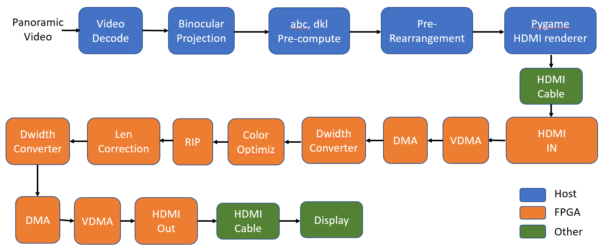
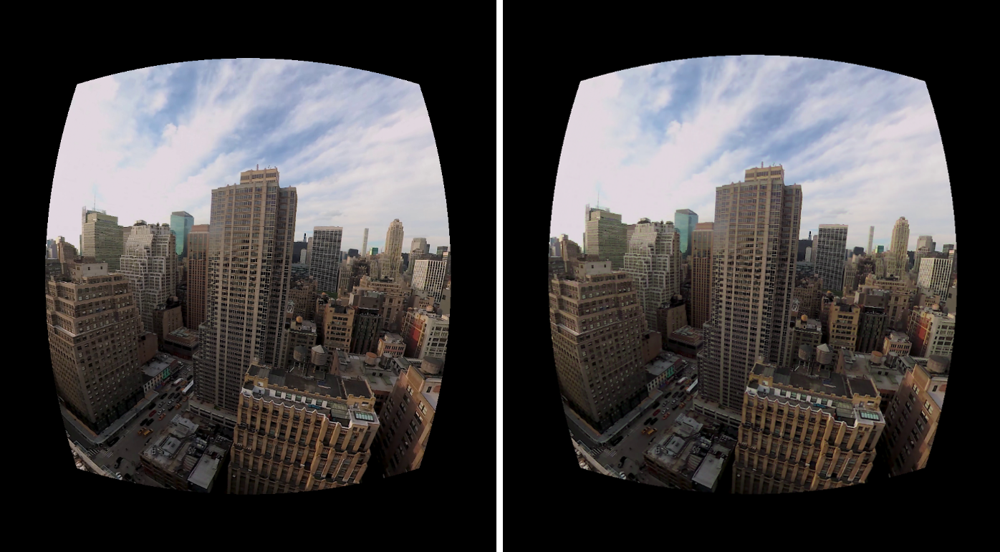
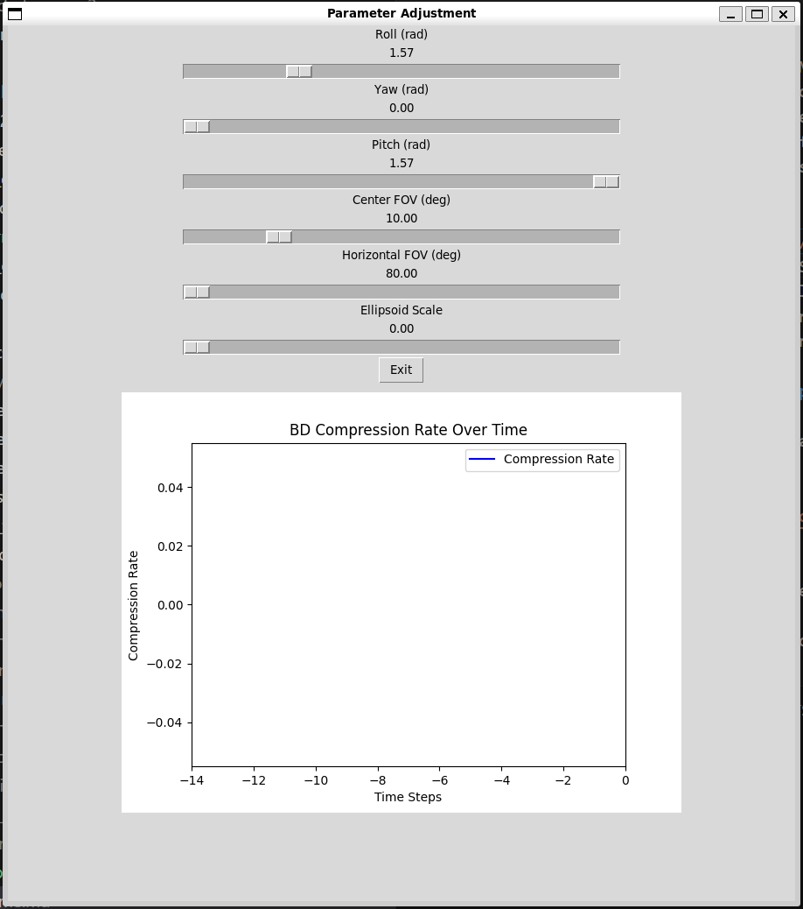

# Gaze-Contingent Framebuffer Compression for Virtual Reality: An FPGA Demo
[Weikai Lin](https://linwk20.github.io/)

## 1. Overview

This is an FPGA demonstration of the color discrimination-guided framebuffer compression for VR, which is described in our [ASPLOS 2024 paper](https://horizon-lab.org/pubs/asplos24-vr.pdf). Our algorithm leverages the (eccentricity-dependent) color discrimination of human visual system to bring pixel colors closer to each other and, thus, enhance the compression effectiveness of the existing Base Delta (BD) algorithm used in today's framebuffer compression.

### 1.1 Overall Pipeline

The figure illustrates the end-to-end system pipeline, which takes a panoramic (equirectangular) video, projects it to both eyes, and compresses the projected videos using our (numerically lossy but perceptually lossless) compression algorithm, which works on top of the BD algorithm.  For the description of a variant of the BD algorithm, see [this paper](https://dl.acm.org/doi/10.1145/3352460.3358298) (among other sources you can find online). The compressed video is displayed on a [Waveshare OLED](https://www.amazon.com/gp/product/B083BKSVNP/) compatible with [Google Cardboard](https://arvr.google.com/cardboard/). The pipeline is divided into two groups: one operating on the host machine and the other on an FPGA board (which in this demo is [Zynq UltraScale+ ZCU104](https://www.xilinx.com/products/boards-and-kits/zcu104.html)). The host machine and the FPGA board are interconnected via an HDMI cable, as is the connection between the FPGA board and the display.  The IP blocks related to the baseline BD encoder/decoder are currently not included yet, but will be added soon enough.



### 1.2 An Sample Output
- Left: Original (BD compression rate = 34.62%), Right: Color-Optimized  (BD compression rate = 42.08%)




## 2. Directory Organization


- [scripts/](scripts/) : Scripts for running demo.
    - [pipeline_on_cpu/](scripts/pipeline_on_cpu/): scripts for running software-only pipeline on CPU
    - [pipeline_on_gpu/](scripts/pipeline_on_gpu/): scripts for running software-only pipeline on GPU
    - [pipeline_on_gpu_fpga/](scripts/pipeline_on_gpu_fpga/): scripts for running pipeline on GPU + FPGA

- [host/](host/): Modules run on the host machine (CPU and/or GPU)
    - [projection/](host/projection/): perspective projection from eqirectangular images ([why such a projection is necessary and how it's done?](https://cs.rochester.edu/courses/572/fall2022/decks/lect17-immersive.pdf))
    - [len_correction/](host/len_correction/): lens correction
    - [color_optimizer/](host/color_optimizer/): color optimizer (the core of our compression algorithm)
    - [base_delta/](host/base_delta/): the baseline BD encoder and decoder
    - [video_processing/](host/video_processing/): video data pre/post-processing

- [fpga/](fpga/): Modules run on FPGA board (HLS implementations)
    - [tile_color_optimizer_hls/](fpga/tile_color_optimizer_hls/): color optimizer (the core of our compression algorithm)
    - [len_correction_hls/](fpga/len_correction_hls/): lens correction
    - [rearrangment_hls/](fpga/rearrangment_hls/): Verilog and HLS implementation of 4x4 to 1x1 rearrangement IP (RIP) on FPGA, which is used to convert data format between the color optimizer IP and the lens correction IP
    - [double_output_hls/](fpga/double_output_hls/): copy left-eye image to the right eye (yes, this demo doesn't provide stereo depth cue --- see later; also has the `t_last` signal needed by DMA)
    - [pynq_scripts/](fpga/pynq_scripts/): Jupyter notebook running on the PS in ZCU104
    - [end2end_bitstream/](fpga/end2end_bitstream/): bitstream generated for the GPU+FPGA demo.
    - [ip_repo/](fpga/ip_repo/): exported HLS IPs needed by the GPU+FPGA demo
    - [BD_enc_hls/](fpga/BD_enc_hls/): BD encoder
    - [BD_dec_hls/](fpga/BD_dec_hls/): BD decoder
    - [dma_hls/](fpga/dma_hls/): a customized DMA (can deal with variable transaction size, etc., and is not yet integrated into the pipeline)
    - [vivado_scripts/](fpga/vivado_scripts/): scripts for generating and connecting all modules in the block design (TBD)


## 3. Using Software-Only Pipeline (CPU or GPU/CUDA)

This section is about how to run the full pipeline in software only manner. It is useful for quick check of expected result. It mainly contains below pipeline


### 3.1 Equirectangular Images Preparation: 
To start this experiment, you need to prepare a panoramic Video in equirectangular format.

If you don't have one, you can download our raw video from https://drive.google.com/drive/folders/1A16SSEeHIVEVFFKJjBaMvGev1zm46eUa?usp=sharing, it contains 6 videos used in the paper.

```bash
cd <top_folder>
# Decode Video to a Folder of Images
python3 host/video_encode_decode/decode_video.py --video_path <downloaded_video.mp4> --out_images_folder ./decoded_images
```
Now you can find decoded images in [decoded_images/](decoded_images/) in the main folder. 
### 3.2 Run the Full color optimizer pipeline

We provide scripts to run the full color optimizer pipeline in SW, including CPU, GPU implementations. All modules are corrently run in sequential order. It can be extend to ROS-like parrallel implementation in the future.

For this project, the left and right eye images are exactly the same, since the input is a single equirectangular image, which supports only 3 DoF.  If the input video is captured in, for instance, an Omni-Directional Stereo (ODS) format, we could render actual stereo disparity.  See [this slide deck](https://cs.rochester.edu/courses/572/fall2022/decks/lect17-immersive.pdf) for details.  Because of this limitation, observers don't get depth perception from stereo disparity.

(1) The scripts to run the whole pipeline for one frame is implemented in `scripts/pipeline_on_<device>/per_frame_seq_pipeline.py`, please refer them to see how to use and concatenate all modules implemented in CPU , GPU.

(2) Every module's main function also shows example of how to use it. For example, the example code for projection is drawing the cube map and test FPS, you can run it as follow:
```bash
cd <top_folder>/host/projection
python3 equirect_to_pespective_cpu.py # if you want to use cuda acceleration, run: python3 equirect_to_pespective_cuda.py
```
(3) Here is how to run whole pipeline on CPU and GPU

See [<top_folder>/scripts/args.py](scripts/args.py) for all supported args.

- For CPU:
```bash
cd <top_folder>
python3 scripts/pipeline_on_cpu/per_frame_loop.py --in_images_folder ./decoded_images --out_images_folder ./corrected_opt_images --display --foveated --save_imgs
```
- For GPU:
```bash
cd <top_folder>
python3 scripts/pipeline_on_gpu/per_frame_loop.py --in_images_folder ./decoded_images --out_images_folder ./corrected_opt_images --display --display_port 0 --foveated
```

For GPU implementation, we also provide a GUI as below for real-time parameters adjustment.




(4) After running the above codes, you will see output in [corrected_opt_images/](corrected_opt_images/) folder in main directory. (if you add --save_imgs)

### 3.3 Video Encoding
If you use CPU implementation and want to observe the realtime results. You can encode images back to video then playback it on your VR display in realtime.
```bash
cd <top_folder> 
python3 host/video_encode_decode/encode_images_to_video.py --video_path ./videos/corrected_opt_images.mp4 --images_folder ./corrected_opt_images --fps 30
```
The output video will be in ```./videos/corrected_opt_images.mp4```

## 4. Using GPU-FPGA Pipeline

This pipeline are basically the same as overall pipeline, except that we add a `output_doubler` after the `lens_correction` since we use same image for both eye because of restriction comes from input equirectangular image as explaned above.

### 4.1 Setup vivado block design and get bitstream for FPGA
We provide the vivado project [here](https://drive.google.com/file/d/1ukujYRWgAs_QBbeWNI5sZ5nr2opewLNR/view?usp=drive_link) (1.6GB). You can use it to generate bitstream for ZCU104.

Hint: You can choose to skip this since we provide pre-generated .bit and .hwh [here](fpga/end2end_bitstream/).

<!-- We provide fully automatic script that can build vivado block design and generate bitstream and hardware handoff file. See Readme in [sripts/vivado](sripts/vivado) for detailed tutorial and reminder. 
```bash
source sripts/vivado/build_bd.sh
source sripts/vivado/generate_bit_hwh.sh
source sripts/vivado/timing_check.sh # make sure the implemented result meet timing requirement
``` -->

### 4.2 Setup PYNQ

(1) Put the generated `end2end.bit` and `end2end.hwh` to a folder in ZCU104.

(2) Put our [PYNQ scripts](fpga/pynq_scripts) to the SAME folder.

(3) If this is the first time you run this demo, you need to config your diver:
- First, plug HDMI to ZCU104's HDMI-IN, plug display to ZCU104's HDMI-OUT, then run [host_setting.ipynb](fpga/host_setting.ipynb). This will help your GPU driver recognize the ZCU104's HDMI (it will be treated as a display).
- Turn off ANY augmentation on the display representing ZCU104, the reason is we want to send the raw Ellipsode data through HDMI port.
- Set that display to be 4K@60Hz since we will use 4K@60Hz bandwidth.

(4) Setup is done, run hdmi_close block in the script then close the notebook. (It is important or pynq will  likely crash)

### 4.3 Run the GPU+FPGA Pipeline

(1) On the host, run: (You need to prepare `./decoded_images` as shown in 3.2 before run this )

See [<top_folder>/scripts/args.py](scripts/args.py) for all supported args. (`--save_imgs` is not supported here)

```bash
cd <top_folder>
# since we add video switch function in gpu+fpga demo, need to cp the video to 
# folder with name <in_images_folderi> i=0 to video_num-1, the reason is our 
# script will automatically search the folder with name <in_images_folderi> i=0 to video_num-1
cp -r ./decoded_images ./decoded_images0
python3 scripts/pipeline_on_gpu_fpga/per_frame_loop.py --in_images_folder ./decoded_images --out_images_folder ./corrected_opt_images --display --display_port 0 --foveated --video_num 1  # change the display port the display representing ZCU104
```

After running the above code, you should see a Pygame window and a GUI similar to GPU demo, but with switch button for video switch.

(2) On the PYNQ, run [board_demo.ipynb](fpga/host_setting.ipynb) , then you will se output on the display.

(3) You should see output on the display now. Don't forget to close HDMI before ending the demo.


## 5. Performance Measurement
### Variants:
- CPU : Parrallelized Numpy, Pytorch-CPU implementation.
- GPU : Cupy, Pytorch-GPU, or Numba Cuda implementation.
- GPU + FPGA: Offload color_optimizer  Lens correction + Display_rendering to FPGA.

### End-to-End FPS

For each configuration there are two settings, one is SW is run sequentially, which will result in lower FPS, and another is that SW is run on ROS, which can enable parallelized pipelined computations and reach higher FPS. The below FPSs do not contain image loading time since we preload the image before running.

(1) Pipeline with: Projection → Len Correction → Ellipsoid prediction → Color optimizer (w/o Ellipsoid prediction). FPS is measured under a 1080x960 image. 

| Config          | Squential SW (pipeline only \| whole loop w. display)
|:-----------------:|:-------------:|
| CPU (EPYC-Zen3)       | 0.66 \| 0.65 
| GPU1 (RTX-4090)        | 51.0 \| 40.5 
| GPU2 (RTX-4060 Mobile on WSL*) | 18.9 \| 17.1 
| GPU2  + FPGA (ZCU104)   | 29.76 |

<!-- | Config          | Squential SW (pipeline only \| whole loop w. display) | SW on ROS(pipeline ony / whole loop w. display) |
|:-----------------:|:-------------:|:-------------:|
| CPU (EPYC-Zen3)       | 0.66 \| 0.65 |TBA|
| GPU (RTX-4090)        | 51.0 \| 40.5 |TBA|
| GPU (RTX-4060 Mobile on WSL*) | 18.9 \| 17.1 |TBA|
| GPU + FPGA (ZCU104)   | TBA |TBA| -->

*: WSL is acronym for Windows Subsystem for Linux, it may affect the performace.

###  Modules' FPS on different Platforms
Below table shows FPS achieved used different HW, the FPS is measured under 1080x960 image.

| HW          | Projection | Lens correction | Ellipsoid prediction | Color optimizer (w/o Ellipsoid prediction) | BD ENC | BD DEC
|:----------------:|:----------:|:--------------:|:--------------------:|:---------------:|:---------------:|:---------------:|
| CPU (EPYC-Zen3)   | 6          | 6.5            | 4.3                  | 1.3               | 7.2 | 23.4
| GPU (RTX-4090)   | 1060       | 1246           | 275                  | 65.7              | 614.4 |  511.8
| GPU (RTX-4060 Mobile on WSL)   | 409.6    | 448.7            | 115.4    | 26.7            | 606.11 | 700.18†
| FPGA (ZCU104)   | --      | 144           | --                   | 288 *            | 288 | 280

*: GPU and CPU optimize both red and blue channel, FPGA only perform blue optimization now, but it only take around 20% of the FPGA resource.

†: The speed of BD DEC on 4060 is faster than 4090, the reason might be CPU difference, 4060 platform uses i9-13900HX which has significantly higher single thread performance than EPYC-Zen3 on 4090 platform.
