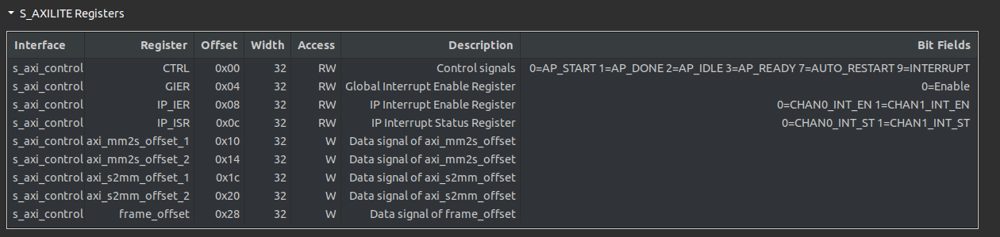
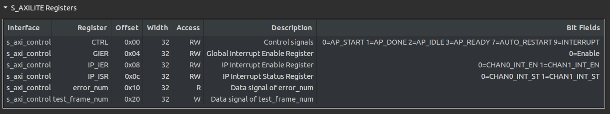

# Customized DMA

## In this folder we implement a DMA that is customized for irregular length DDR access, it is important for BD-encoder and BD-decoder to write to and read  from memory.
## Feature
- Support transaction-granuity memory access, every in/out transaction can contain a extra last bit indicate whether this transaction is 
- Burst Transmission: supported by hls::burst_maxi
- Double Buffering inside DDR
last of a frame.

Example for in / out type:
```c++
struct dma_t
{
	data_t data;
	ap_uint<1> last;
};
```
## Configuration

### -  Hard_coded Param in [dma.h](./dma.h) - (statically  configurable)
You can config the data_width (data_t) and MaxBurstSize in [dma.h](./dma.h) at line 6 and line 7. But you need to regenerate the IP after this configuration.

### - S_AXI_LITE - (dynamically configurable)

For 0x00 - 0x10, the S_AXI_LITE signal related to IP control, please see :https://docs.xilinx.com/r/en-US/ug1399-vitis-hls/S_AXILITE-Control-Register-Map

DMA:

- axi_mm2s/axi_s2mm offset: 64 bit address of memory offset (base address)
- frame offset: 32 bit frame offset for double buffering. Frame Size (byte) = Chunck Size(byte) * frame_offset




Result Checker:
- error_num: the error number, should be zero.
- test_frame_num: test how many frames in this trigger.




## COSIM Limitation
There are two components during simulation, outer memory (emulated by an array in C++) and DMA (HW)
- In Csim, the simulation works well.
However, in Cosim, it only support  read / write outer C++ memory array once , which means it will collect the outside (SW) array value before start and write the results back after whole RTL simulation.
It cause the problem that the data written by DDR writer can never be propagated to DDR reader during RTL simulation since the memory array is outside of HW and will be updated after RTL simulation. Due to this, now I can only simulate 2 frames transmission by initializing the double buffer with correct values before simulation so reader can read them. If we want to do RTL simulation with more than two frames with the real behavior.
    - if we want to test the actual hardware behavior, we need to do it in Vivado, including writing a test pattern generator, concatenating it with DMA, and using BRAM to emulate DDR behavior.
    - The folder [/dma_tester_hls](/dma_tester_hls) contains the test pattern generator and results checker that can be used in Vivado end2end RTL test.


