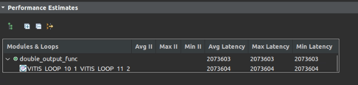

# Image Output Doubler HLS implementation

## Since in our current pipeline we only compute one-eye image and copy it to another eye, so we need this IP to copy the image. Also, this IP will deal with the interfacing with DMA, it will output tlast, tkeep require by DMA.

**Notice**: This module use BGR input output. Other module may use RGB format. PYNQ use BGR.

## Example: Input and Output
<p float="left">
  
  
</p>

## Performance Estimation

FPS = 300M (Hz) / 2073603 = 144



## Resource Util.


## Generate Golden Sequence
```bash
cd gold_sequence/
python3 len_correction_get_gold_seq.py
```


