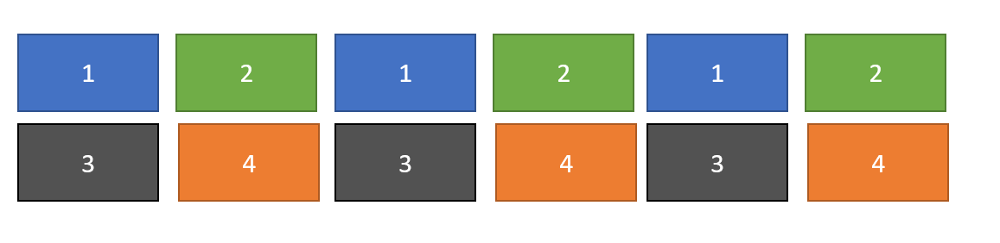
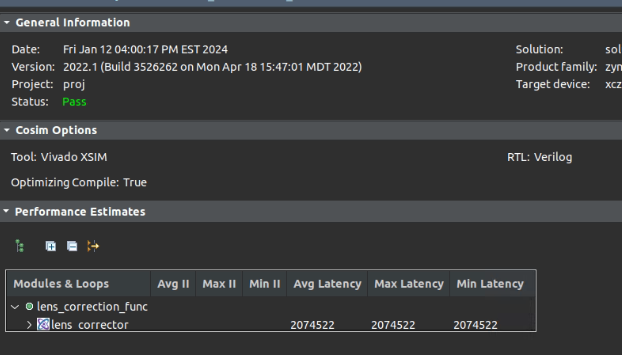
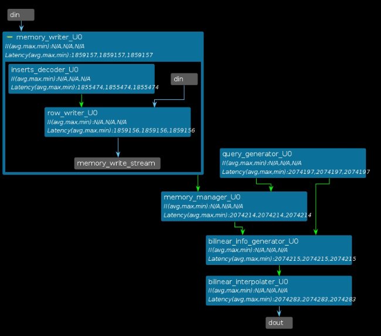

# Lens correction HLS implementation

## This Design focus on accessing only one-time row-order pixel input though we can let FPGA control DMA to access DDR randomly and multiple times since DDR access will introduce much latency and energy comsumption.


## 1. Special Storage for Bilinear intepolation

Since we need to access four pixels and perform bilinear intepolation for one output, and BRAM/URAM has less than 4 ports . we need to design the memory layout to eliminate conflictions so we don't need to buffer 4 copies. One easy way is as follow. That is, we use 4 buffers and store pixel on even row, even col to buffer 1. even row, single col to buffer 2, and so on. Now we only need every memory to be single port.

Compare to naive method, we can save 4x buffer usage. Also, by utilizing the loclality of lens correction, we don't need to buffer full image but only 185 rows given our lens parameters, which can save 6x more buffersize. In total we can save around 24x buffersize by smartly design the on-chip buffer strategy. Which make the implementation feasible on ZCU104 ( Reduce the Utilization of URAM from 1000% to  45%)

Also, I don't use double buffering so producer / consumer will be stalled alternatively. The reason is that we do not have enough on-chip ram for double buffering and the FPS is enough.



## 2. FPS from Cosim
From the Cosim result, we can estimzte FPS as follow: (Pipeline flushing time is negligible compare to full frame latency)

FPS = 300M (Hz) / 2074522 (Latency for one frame)  = 144



## 3. Dataflow in HLS




## 4. Usage

### 4.1 Generate Golden Sequence 
```bash
cd gold_sequence/
python3 len_correction_get_gold_seq.py
```

### 4.2 Generate Precomputed Buffer management parameters
```bash
cd precomputation/
python3 generate_precompute_constants.py
```
