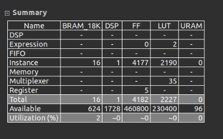
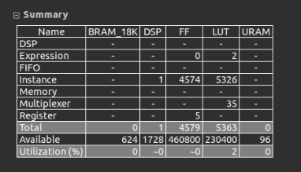
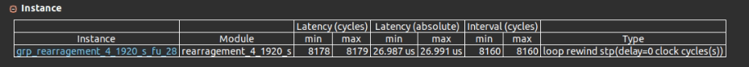

# rearrangement IP

Transfom 4x4 tile in row order to 1x1 pixel in row order.

Also, it change the pixel from RGB format to BGR needed by pynq

## Resource 
Use BRAM for buffering: 

Use ```#pragma HLS bind_storage variable=pixel_buffer_1 type=ram_1p impl=bram``` at line 32 at rearrangement.h



Use LUT for buffering: 

Use ```#pragma HLS bind_storage variable=pixel_buffer_1 type=ram_1p impl=lutram``` instead



## Timing
*this one is computed under 1920 x 1080 image size*

Use the result from lutram variant  here

1 cycle for every input and output, no double buffering.

II=8160 for 4 rows (load_num + ouput_num)
- load_num = 1920 / 4 = 480
- ouput_num = 1920 * 4 = 7680



FPS = 136.1742112482853
- Computation: 8160 cycles for 4 rows @ 300MHz
    - FPS (136) = 3e8 / 8160 / (1080/4)


