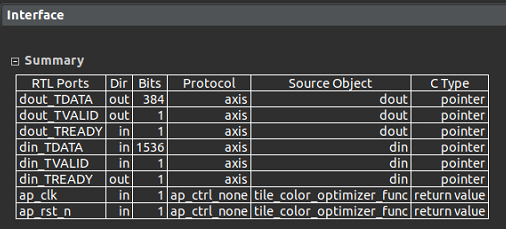
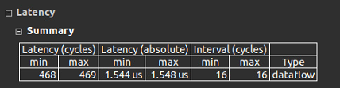
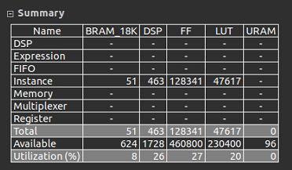
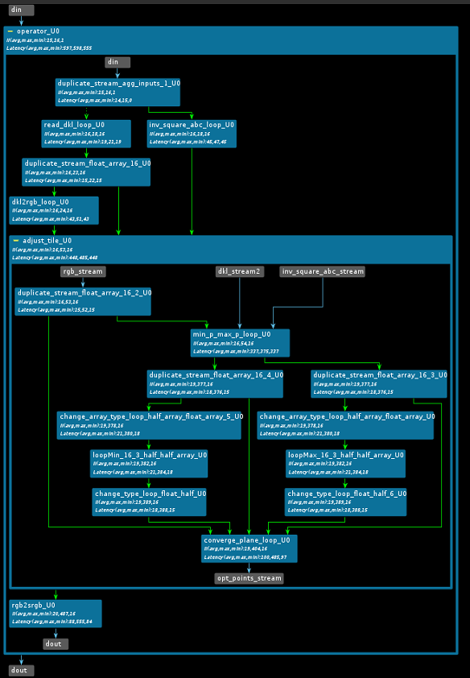

# HLS implementation for color optimizer

It is a fp32 implementation of the color optimizer, only perform the blue channel compression.  
**Fmax** = 300MHz, **Initial Interval** = 16, **FPS** = 288 images/sec on 1080x960 images.
(loopMin, loopMax are fp16 because data dependentcy cause it cannot run at 300MHz@fp32 )

Need to manally set some channel's depth to prevent deadlock.

**Notice**: This module use RGB input output. Other module may use BGR format. PYNQ use BGR too.

## Files Organization

- `tile_color_optimizer_func_tb.cpp`: Contain Test_bench
- `tile_color_optimizer_func.h`: Contain hardware implementation
- `tile_color_optimizer_func.cpp`: Contain top-level function


## HLS reports

### Interface

### Latency

### Util in HLS (will be lower after vivado synth)

### Dataflow



## Generate Golden Sequence 
```bash
cd gold_sequence/
python3 len_correction_get_gold_seq.py
```
