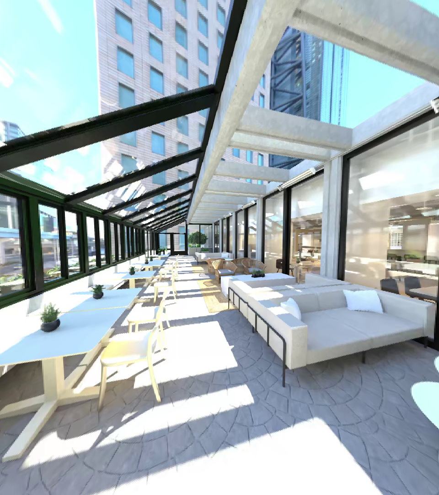
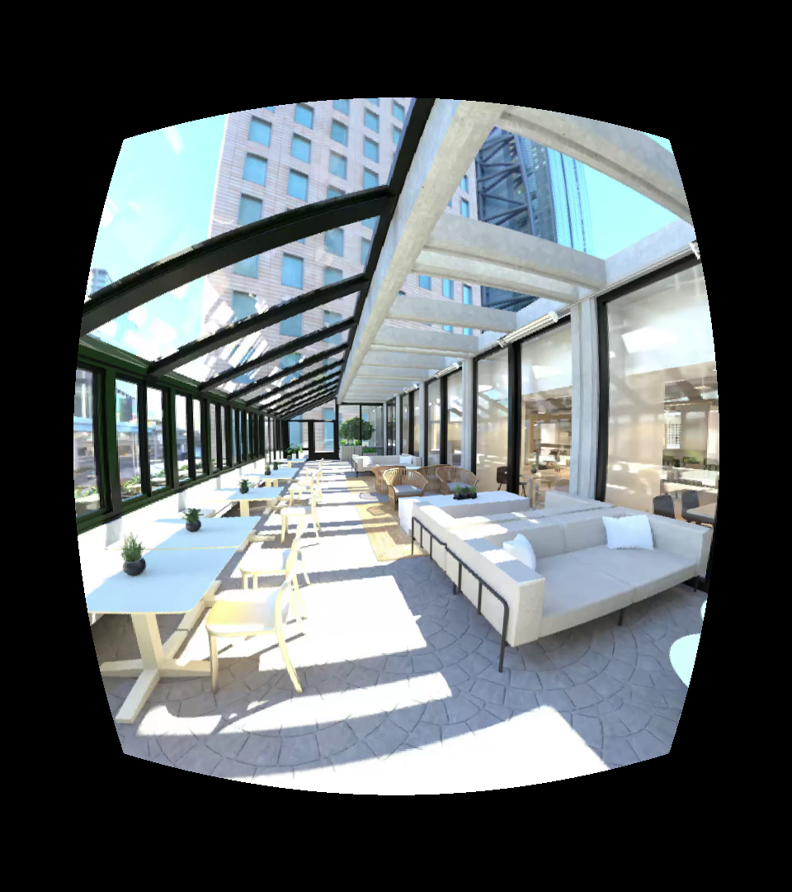

## len_correction.py Examples
### k1, k2 = 0.33582564, 0.55348791 # Radial distortion coefficients by default
### How to run example usecase (Correct one 1080x960 image with fps measurement) 
For CPU vrsion (about 6.5 fps on EPYC-Zen3 CPU), run:
```bash
python3 len_correction_cpu.py
```
For GPU version (about 1246 fps on RTX-4090), run:
```bash
python3 equirect_to_pespective_cuda.py
```


### Example: Input Image v.s. Corrected Output (in folder images/)
<p float="left">
  
  
</p>