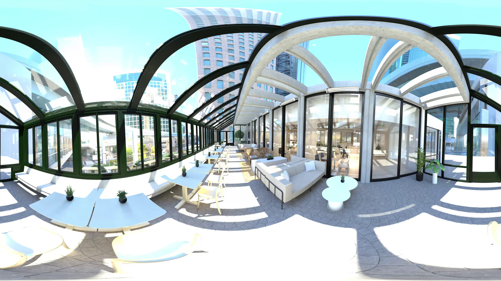
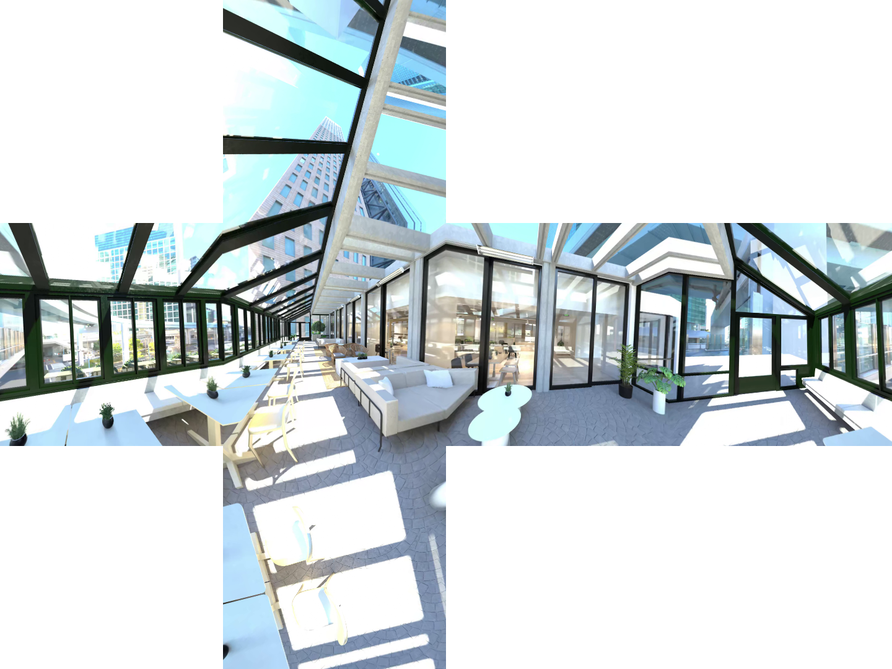

## equirect_to_pespective.py Examples
### How to run example usecase (perspective cube and 1080x960 projection with fps measurement)
For CPU vrsion (about 6 fps on EPYC-7C13), run:
```bash
python3 equirect_to_pespective_cpu.py
```

For GPU version (about 1060 fps on RTX-4090), run:
```bash
python3 equirect_to_pespective_cuda.py
```


### Example: Input Image v.s. Output perspective cube (in folder images/)
<p float="left">
  
  
</p>