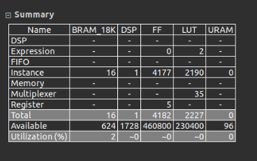

# rearrangement IP

Transfom 4x4 tile in row order to 1x1 pixel in row order

## Resource 
Use BRAM for buffering: 

Use ```#pragma HLS bind_storage variable=pixel_buffer_1 type=ram_1p impl=bram``` at line 32 at rearrangement.h



Use LUT for buffering: 

Use ```#pragma HLS bind_storage variable=pixel_buffer_1 type=ram_1p impl=lutram``` instead


## Timing

Use the result from lutram variant  here

II (Initial Interval) = 1

FPS = 136.1742112482853
- Computation: 8160 cycles for 4 rows @ 300MHz
    - FPS (136) = 3e8 / 8160 / (1080/4)


