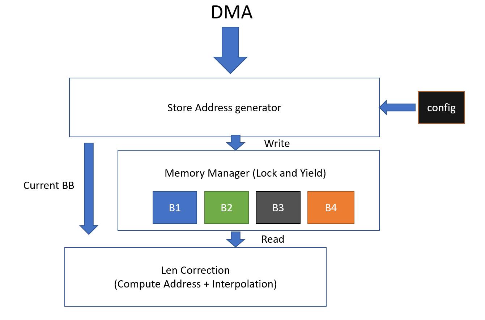

# Design of HLS HW

## This Design focus on access only one-time streaming Color adjustor output (tile-by-tile) and finish Len correction though we can let FPGA control DMA to access DDR randomly and multiple times.

## 1. Feasibility

We analyze the idx access pattern and found that we only need to buffer 184 rows at most, it is correspond to 184 * 960 * 24 = 4Mb, which can be handle by FPGA on-chip memory easily. So even though we can reduce on-chip buffersize by co-optimize it and off chip access pattern, we don't do it here.

## 2. Special Storage for Bilinear intepolation

Since we need to access four pixels and perform bilinear intepolation for one output, and BRAM/URAM less than 4 ports . we need to design the memory layout to eliminate conflictions to maintain one output per cycle. One easy way is as follow. That is, we store pixel on even row, even col to 1. even row, single col to 2, and so on. Now we only need every memory to be single port.

## 3. Dataflow

## 4. Throughput Estimation

Peak: 
300MHz (Expected Clock) / 960 / 1080 = 289 fps  (since we duplicate the image to get 1080 * 1920)

No-double buffer: above 145 fps, more than enough (Input preparation is faster.)

Since , frame rate is enough, we don't use double buffering.

